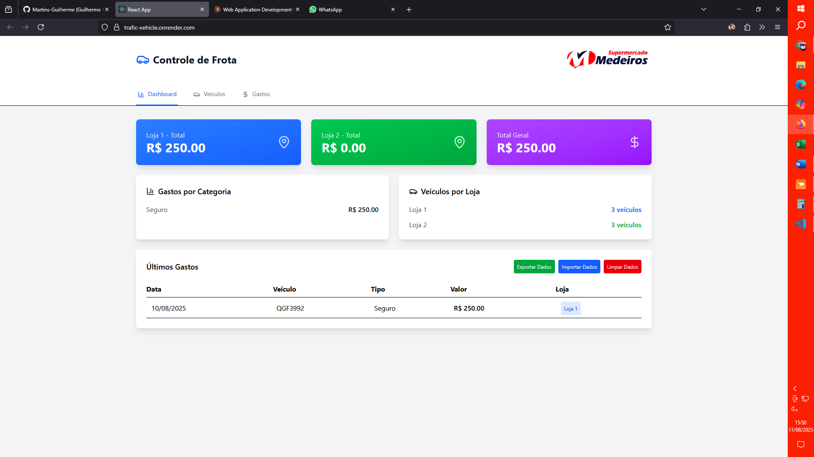

Um projeto de controle de frota desenvolvido em React, utilizando localStorage para a persistência dos dados. A aplicação oferece uma interface para gerenciar gastos e veículos por loja.

Funcionalidades:

    Dashboard com resumos financeiros (gastos totais, por loja e por categoria).

    Lista de veículos por loja.

    Registro e listagem de gastos com informações detalhadas (data, veículo, valor, loja).

    Opções para exportar, importar e limpar dados.

Tecnologias Utilizadas:

    React.js

    localStorage

    Tailwind CSS

Como Executar:

    Clone o repositório: git clone [URL_DO_REPO]

    Instale as dependências: npm install ou yarn install

    Inicie o servidor de desenvolvimento: npm start ou yarn start

Este projeto é um excelente ponto de partida para quem deseja aprender sobre persistência de dados no front-end e gerenciamento de estado em aplicações React. A arquitetura modular facilita a transição para um backend mais robusto.
